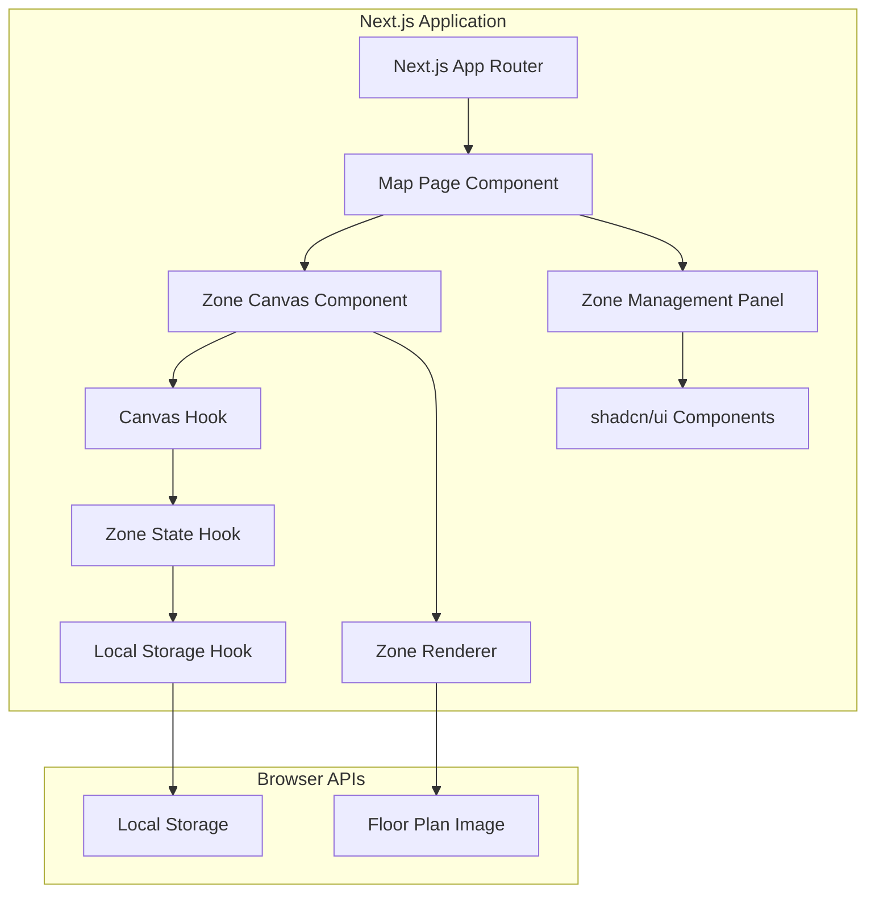

# Interactive Zone Manager Design Document

## Overview

The Interactive Zone Manager is a web-based application that provides an admin interface for drawing and managing polygonal zones on a floor plan image. The system uses HTML5 Canvas for interactive drawing, JavaScript for zone management logic, and browser Local Storage for data persistence. The application will be accessible at the `/map` route and provide real-time zone status management with company name assignments.

## Architecture

### High-Level Architecture



### Technology Stack

- **Frontend Framework**: Next.js 14+ with React 18+
- **Styling**: Tailwind CSS for utility-first styling
- **UI Components**: shadcn/ui component library
- **Canvas Library**: Fabric.js or Konva.js for advanced canvas interactions
- **Data Persistence**: Browser Local Storage with JSON serialization
- **Image Handling**: Next.js Image component with HTML5 Canvas API
- **Routing**: Next.js App Router for `/map` route
- **State Management**: React useState/useReducer with custom hooks

## Components and Interfaces

### 1. Map Page Component (`/app/map/page.tsx`)

**Purpose**: Main page component that orchestrates the zone management interface.

**Props**: None (page component)
**State**: Loading state, error handling
**Key Features**:
- Layout with canvas and management panel
- Error boundaries for graceful error handling
- Responsive design with Tailwind CSS

### 2. Zone Canvas Component (`/components/ZoneCanvas.tsx`)

**Purpose**: React component wrapping the interactive canvas functionality.

**Props**:
```typescript
interface ZoneCanvasProps {
  floorPlanUrl: string;
  zones: Zone[];
  onZoneCreate: (vertices: Point[]) => void;
  onZoneUpdate: (zoneId: string, updates: Partial<Zone>) => void;
  onZoneDelete: (zoneId: string) => void;
}
```

**Key Features**:
- Canvas initialization with useEffect
- Event handling for zone interactions
- Integration with Fabric.js or Konva.js for advanced canvas operations

### 3. Zone Management Panel (`/components/ZoneManagementPanel.tsx`)

**Purpose**: Side panel with zone controls and information using shadcn/ui components.

**Props**:
```typescript
interface ZoneManagementPanelProps {
  zones: Zone[];
  selectedZone: Zone | null;
  onZoneSelect: (zoneId: string) => void;
  onCompanyNameUpdate: (zoneId: string, name: string) => void;
}
```

**shadcn/ui Components Used**:
- `Card` for zone information display
- `Button` for actions
- `Input` for company name editing
- `Badge` for zone status indicators
- `Dialog` for confirmation modals
- `ScrollArea` for zone list

### 4. Custom Hooks

#### `useZoneState` Hook
**Purpose**: Manages zone state and operations.

```typescript
interface UseZoneStateReturn {
  zones: Zone[];
  createZone: (vertices: Point[]) => void;
  updateZone: (zoneId: string, updates: Partial<Zone>) => void;
  deleteZone: (zoneId: string) => void;
  selectedZone: Zone | null;
  setSelectedZone: (zone: Zone | null) => void;
}
```

#### `useLocalStorage` Hook
**Purpose**: Handles Local Storage operations with React state synchronization.

```typescript
interface UseLocalStorageReturn<T> {
  data: T;
  setData: (data: T) => void;
  isLoading: boolean;
  error: string | null;
}
```

#### `useCanvas` Hook
**Purpose**: Manages canvas initialization and interactions.

```typescript
interface UseCanvasReturn {
  canvasRef: RefObject<HTMLCanvasElement>;
  isDrawing: boolean;
  currentVertices: Point[];
  initializeCanvas: () => void;
  handleCanvasClick: (event: MouseEvent) => void;
  handleCanvasRightClick: (event: MouseEvent) => void;
}
```

### 5. Zone Data Model

**TypeScript Interfaces**:
```typescript
interface Point {
  x: number;
  y: number;
}

interface Zone {
  id: string;
  vertices: Point[];
  status: 'free' | 'occupied';
  companyName: string | null;
  createdAt: number;
  updatedAt: number;
}

interface ZoneStorage {
  version: string;
  zones: Zone[];
  lastModified: number;
}
```

### 6. Utility Functions

**Zone Operations** (`/lib/zoneUtils.ts`):
- `createZone(vertices: Point[]): Zone`
- `isPointInPolygon(point: Point, vertices: Point[]): boolean`
- `validatePolygon(vertices: Point[]): boolean`
- `calculatePolygonArea(vertices: Point[]): number`

**Canvas Utilities** (`/lib/canvasUtils.ts`):
- `drawPolygon(ctx: CanvasRenderingContext2D, vertices: Point[], style: ZoneStyle): void`
- `getCanvasCoordinates(event: MouseEvent, canvas: HTMLCanvasElement): Point`
- `clearCanvas(ctx: CanvasRenderingContext2D): void`

## Data Models

### Zone State Management

**Zone Lifecycle**:
1. **Creation**: User clicks to define vertices → temporary polygon → completed zone
2. **Status Change**: Click toggles free ↔ occupied
3. **Company Assignment**: Occupied status triggers name input
4. **Editing**: Right-click enables vertex manipulation
5. **Deletion**: Confirmation dialog → removal from storage

### Data Validation

**Polygon Validation**:
- Minimum 4 vertices, maximum 6 vertices
- No self-intersecting polygons
- Minimum area threshold to prevent accidental tiny zones

**Company Name Validation**:
- 1-50 characters
- Alphanumeric characters, spaces, hyphens allowed
- Trim whitespace, prevent empty strings

## Error Handling

### Canvas Errors
- **Image Load Failure**: Display error message, provide retry mechanism
- **Canvas Not Supported**: Graceful degradation with browser upgrade message

### Storage Errors
- **Local Storage Full**: Alert user, provide data export option
- **Storage Unavailable**: In-memory fallback with session warning
- **Data Corruption**: Reset to empty state with user notification

### User Input Errors
- **Invalid Polygon**: Visual feedback, prevent completion
- **Invalid Company Name**: Real-time validation with error messages
- **Network Issues**: Offline-first design, no external dependencies

### Error Recovery
- Auto-save every 30 seconds as backup
- Validation before storage operations
- Graceful fallbacks for all external dependencies

## Testing Strategy

### Unit Testing Focus
- Zone creation and validation logic
- Hit detection algorithms (point-in-polygon)
- Data serialization/deserialization
- Storage manager operations

### Integration Testing
- Canvas rendering with zone data
- Event handling workflows
- Storage persistence across sessions
- Error handling scenarios

### Manual Testing Scenarios
- Create zones with different vertex counts
- Toggle status and assign company names
- Edit and delete existing zones
- Browser refresh and data persistence
- Right-click context menu functionality
- Responsive behavior on different screen sizes

### Performance Considerations
- Efficient hit detection for large numbers of zones
- Canvas redraw optimization (only when necessary)
- Debounced storage operations to prevent excessive writes
- Memory management for large floor plan images

## Implementation Notes

### Canvas Coordinate System
- Use canvas pixel coordinates for zone storage
- Implement zoom/pan functionality for large floor plans
- Handle high-DPI displays with proper scaling

### Accessibility
- Keyboard navigation support for zone management
- Screen reader compatible zone descriptions
- High contrast mode support
- Focus indicators for interactive elements

### Browser Compatibility
- Target modern browsers supported by Next.js (Chrome 64+, Firefox 67+, Safari 12+, Edge 79+)
- Progressive enhancement with Next.js built-in optimizations
- Mobile touch event support for tablet use
- Responsive design with Tailwind CSS breakpoints

### Security Considerations
- Client-side only application (no server communication)
- Input sanitization for company names
- Local Storage data validation on load
- XSS prevention in dynamic content rendering